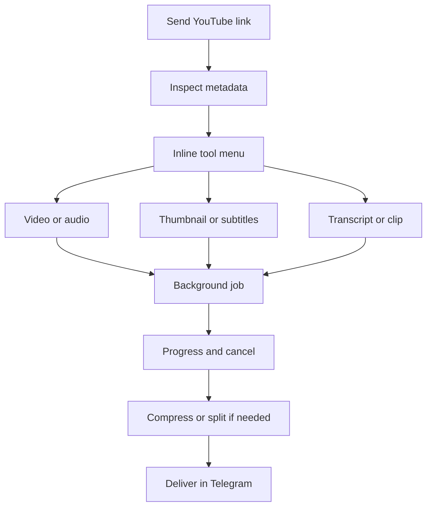
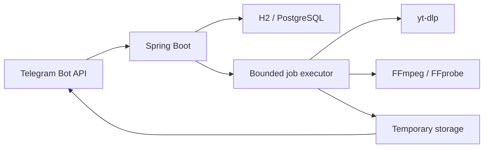

# TubeForge Bot

TubeForge is a complete, self-hosted Telegram media toolkit built with Java 17 and Spring Boot 4. Send a supported YouTube link and use inline buttons to create an authorized video, audio track, thumbnail bundle, subtitle file, clean transcript, precise clip, or playlist export.

The application uses only free, open-source components. It does not require an AI API, payment provider, domain, webhook, or subscription. AI Studio is deliberately displayed as a polished **Coming soon** screen.

> Use TubeForge only for media you own, public-domain or Creative Commons material, and other content you are authorized to download or process. Do not use it to bypass access controls or infringe copyright.

## Features

- Automatic recognition of normal YouTube URLs, `youtu.be`, Shorts, timestamped links and public playlists
- Rich preview with title, channel, duration, views, type, available qualities and subtitle languages
- Inline keyboards throughout the complete flow
- Video quality selection from the formats actually reported by YouTube, plus best and smallest options
- Full audio extraction to MP3, M4A, WAV, OGG or FLAC, with quality selection and metadata
- Best thumbnail or a ZIP containing all available thumbnails
- Official and automatic subtitles exported as SRT
- Clean TXT transcripts generated locally from subtitles
- Video and audio clips from a user-supplied timestamp range
- Controlled public-playlist processing with configurable item limits
- Persistent link history, job history and user preferences
- English, Russian and Uzbek interface selection
- Live progress bars, speed/ETA display and cancellable background jobs
- Daily user quotas, owner/admin IDs, public or allowlist access
- Terms acceptance and privacy information
- Automatic compression and multi-part delivery for files above the configured Telegram limit
- H2 for simple local runs and PostgreSQL for Docker deployments
- Temporary-media cleanup, database migrations, health checks and graceful shutdown
- Multi-stage Docker image, Docker Compose, Maven Wrapper and GitHub Actions CI
- Unit and Spring integration tests

## Five-minute start with Docker

You need [Docker Desktop](https://www.docker.com/products/docker-desktop/) on Windows/macOS or Docker Engine with Compose on Linux.

1. Open Telegram and create a bot using [`@BotFather`](https://t.me/BotFather).
2. Copy the example configuration:

   ```bash
   cp .env.example .env
   ```

   On Windows PowerShell:

   ```powershell
   Copy-Item .env.example .env
   ```

3. Open `.env` and replace `TELEGRAM_BOT_TOKEN` with the BotFather token.
4. Build and run:

   ```bash
   docker compose up --build -d
   ```

5. Open the bot in Telegram, send `/start`, accept the terms and send a YouTube link.
6. Follow logs if needed:

   ```bash
   docker compose logs -f bot
   ```

The bot uses long polling, so local testing does not require a public URL, HTTPS certificate, router configuration or open inbound port. Port `8080` only exposes the local status and health endpoints.

## Run directly without Docker

Install:

- Java 17 or newer
- FFmpeg and FFprobe
- a current stable yt-dlp
- Deno 2.3+ or Node.js 22+ for yt-dlp's current YouTube JavaScript support

Then:

```bash
export TELEGRAM_BOT_TOKEN="your-token"
./scripts/preflight.sh
./mvnw spring-boot:run
```

The direct run uses a persistent H2 database under `./data` and temporary media under `./storage`.

## User flow



## Telegram commands

| Command | Purpose |
|---|---|
| `/start` | Open TubeForge and accept terms |
| `/help` | Show the short user guide |
| `/history` | Reopen recent inspected links |
| `/jobs` | View active and recent processing jobs |
| `/settings` | Change language, default formats and delivery behavior |
| `/terms` | Review responsible-use terms |
| `/privacy` | Review locally stored data |
| `/id` | Display the numeric Telegram user ID |
| `/admin` | Show owner statistics and feature state |

## Important configuration

| Variable | Default | Description |
|---|---:|---|
| `TELEGRAM_BOT_TOKEN` | required | Secret token from BotFather |
| `ACCESS_MODE` | `PUBLIC` | `PUBLIC` or `ALLOWLIST` |
| `ADMIN_USER_IDS` | empty | Comma-separated numeric Telegram IDs |
| `ALLOWED_USER_IDS` | empty | IDs permitted in allowlist mode |
| `DAILY_JOB_LIMIT` | `20` | Jobs per non-admin user in 24 hours |
| `MAX_CONCURRENT_JOBS` | `2` | Media processes running simultaneously |
| `MAX_VIDEO_DURATION_SECONDS` | `10800` | Maximum non-playlist duration |
| `MAX_PLAYLIST_ITEMS` | `20` | Maximum public-playlist items |
| `TELEGRAM_MAX_UPLOAD_BYTES` | `50000000` | Upload target for the standard Bot API |
| `MEDIA_CACHE_RETENTION` | `PT24H` | Local result retention before cleanup |
| `ACCESS_MODE` | `PUBLIC` | Switch to `ALLOWLIST` for a private bot |
| `FEATURE_*` | `true` | Independently enable or disable tools |

Every supported setting is documented in [`.env.example`](.env.example).

## Make the bot private

1. Send `/id` to the running bot.
2. Put the returned ID into both `ADMIN_USER_IDS` and `ALLOWED_USER_IDS`.
3. Change `ACCESS_MODE=ALLOWLIST`.
4. Restart the bot:

   ```bash
   docker compose up -d
   ```

Unauthorized users receive only their own Telegram ID and setup guidance.

## File-size behavior

The standard hosted Telegram Bot API has a much smaller upload limit than a locally hosted Bot API server. TubeForge therefore defaults to a conservative 50 MB target. When a result exceeds the configured target, it can:

1. transcode video or audio toward the target size;
2. split remaining oversized media into numbered parts;
3. return a clear failure if a non-media archive cannot safely fit.

Users can turn automatic compression off in `/settings`. The upload target is configurable for deployments using Telegram's local Bot API server.

## Health and operations

- Application status: `http://localhost:8080/`
- Spring health: `http://localhost:8080/actuator/health`
- Application information: `http://localhost:8080/actuator/info`
- Bot logs: `docker compose logs -f bot`
- Database backup: back up the `postgres_data` Docker volume
- Temporary media: stored in `media_storage` and removed after the retention period

## Test and package

```bash
./mvnw clean verify
```

The Maven build validates Java/Maven versions, runs all tests, produces a coverage report and creates:

```text
target/tubeforge-bot-1.0.0.jar
```

## Architecture



The Telegram integration is implemented directly against the official HTTP Bot API. External process arguments are passed as arrays through Java `ProcessBuilder`; Telegram users cannot insert shell commands or arbitrary yt-dlp options. YouTube URLs are accepted only from a strict host allowlist.

See [Architecture](docs/ARCHITECTURE.md), [Deployment](docs/DEPLOYMENT.md), and [Testing](docs/TESTING.md) for additional details.

## Known platform constraints

- YouTube changes frequently. Keep yt-dlp current when extraction starts failing.
- Private, paid, members-only, DRM-protected and access-controlled media is intentionally unsupported.
- Region-restricted or age-verification media may be unavailable from the deployment server.
- Playlist downloads can consume significant disk, CPU and upload bandwidth; limits are intentionally conservative.
- AI Studio is visible but intentionally non-operational until a genuinely free local model workflow is added.

## License

[MIT](LICENSE)
