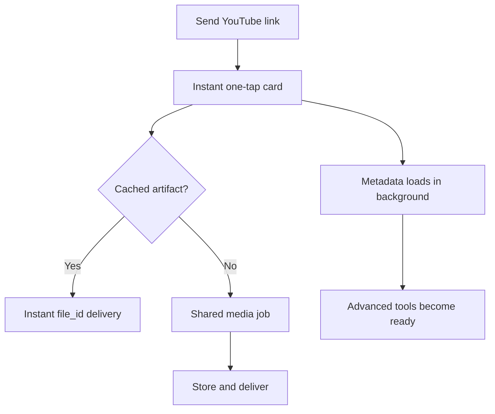
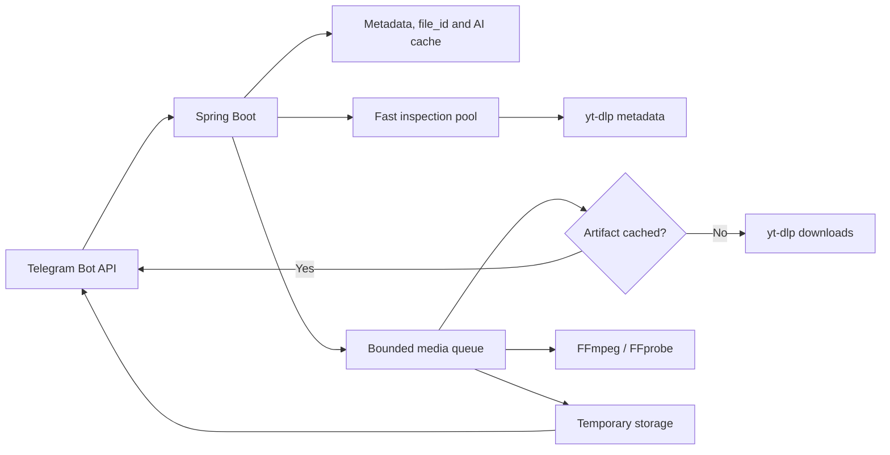

# TubeForge Bot 4

TubeForge is a complete, self-hosted Telegram media toolkit built with Java 17 and Spring Boot 4. Send a supported YouTube link and use inline buttons to create an authorized video, audio track, thumbnail bundle, subtitle file, clean transcript, precise clip, or playlist export.

The application uses only free, open-source components. It does not require a paid AI API, payment provider, domain, webhook, or subscription. Transcript Studio includes fast built-in extractive analysis and can optionally use a real local Ollama model.

> Use TubeForge only for media you own, public-domain or Creative Commons material, and other content you are authorized to download or process. Do not use it to bypass access controls or infringe copyright.

## Features

- Automatic recognition of normal YouTube URLs, `youtu.be`, Shorts, timestamped links and public playlists
- Instant link shell: one-tap video/audio appears before the slower yt-dlp metadata inspection finishes
- Background metadata hydration with visible pending/degraded states and one-tap retry
- Rich image preview with deterministic YouTube thumbnail and automatic text fallback
- Inline keyboards throughout the complete flow
- Video quality selection from the formats actually reported by YouTube, plus best and smallest options
- Full audio extraction to MP3, M4A, WAV, OGG or FLAC, with quality selection and metadata
- Best thumbnail or a ZIP containing all available thumbnails
- Official and automatic subtitles exported as SRT
- Clean TXT transcripts generated locally from subtitles
- Video and audio clips from a user-supplied timestamp range
- Controlled public-playlist processing with configurable item limits
- Persistent link history, job history and user preferences
- English, Russian and Uzbek interface selection
- Live progress bars, speed/ETA display and cancellable background jobs
- One-tap default video/audio actions and compact recommended quality menus
- Global Telegram `file_id` cache for near-instant repeat delivery across users
- Single-flight coordination: one download serves every simultaneous identical request
- Free local transcript summaries, timestamped chapters, key moments and study notes
- Optional Ollama models with automatic local fallback and persistent AI-result caching
- Separate inspection and download pools, metadata reuse and duplicate-job protection
- Verified video+audio streams and zero-conversion delivery when the file is already Telegram-ready H.264/AAC MP4
- Automatic fallback to document delivery when Telegram rejects inline photo, video or audio playback
- Actionable diagnostics for YouTube rate limits, verification prompts, FFmpeg and JavaScript runtime failures
- Interactive owner control center with workload, cache, performance and media-tool health views
- Daily user quotas, owner/admin IDs, public or allowlist access
- Terms acceptance and privacy information
- Automatic compression and multi-part delivery for files above the configured Telegram limit
- H2 for simple local runs and PostgreSQL for Docker deployments
- Temporary-media cleanup, database migrations, health checks and graceful shutdown
- Multi-stage Docker image, Docker Compose, Maven Wrapper and GitHub Actions CI
- Unit and Spring integration tests

## Five-minute start with Docker

You need [Docker Desktop](https://www.docker.com/products/docker-desktop/) on Windows/macOS or Docker Engine with Compose on Linux.

1. Open Telegram and create a bot using [`@BotFather`](https://t.me/BotFather).
2. Copy the example configuration:

   ```bash
   cp .env.example .env
   ```

   On Windows PowerShell:

   ```powershell
   Copy-Item .env.example .env
   ```

3. Open `.env` and replace `TELEGRAM_BOT_TOKEN` with the BotFather token.
4. Build and run:

   ```bash
   docker compose up --build -d
   ```

5. Open the bot in Telegram, send `/start`, accept the terms and send a YouTube link.
6. Follow logs if needed:

   ```bash
   docker compose logs -f bot
   ```

The bot uses long polling, so local testing does not require a public URL, HTTPS certificate, router configuration or open inbound port. Port `8080` only exposes the local status and health endpoints.

## Run directly without Docker

Install:

- Java 17 or newer
- FFmpeg and FFprobe
- a current stable yt-dlp
- Deno 2.3+ or Node.js 22+ for yt-dlp's current YouTube JavaScript support

Then:

```bash
export TELEGRAM_BOT_TOKEN="your-token"
./scripts/preflight.sh
./mvnw spring-boot:run
```

The direct run uses a persistent H2 database under `./data` and temporary media under `./storage`.

### Windows one-command start

The included PowerShell launcher automatically detects the tool layout used in this project:

```text
C:\TubeForgeTools\yt-dlp.exe
C:\TubeForgeTools\ffmpeg\bin\ffmpeg.exe
C:\TubeForgeTools\ffmpeg\bin\ffprobe.exe
```

Run from the project directory:

```powershell
Copy-Item .env.example .env
# Put the BotFather token into .env, then:
powershell -ExecutionPolicy Bypass -File .\scripts\run-windows.ps1
```

The launcher validates Java, yt-dlp, FFmpeg and FFprobe before Spring Boot starts. `application.yml` automatically imports `.env`, so IntelliJ and the launcher use the same configuration. Docker users can run the same script with `-Docker`.

### Optional PostgreSQL

No database setup is required for a personal local bot: H2 is the default. To use the existing PostgreSQL database named `youtube`, add these values to `.env`:

```dotenv
DATABASE_URL=jdbc:postgresql://localhost:5432/youtube
DATABASE_USERNAME=postgres
DATABASE_PASSWORD=your_local_password
```

## User flow



## Telegram commands

| Command | Purpose |
|---|---|
| `/start` | Open TubeForge and accept terms |
| `/help` | Show the short user guide |
| `/history` | Reopen recent inspected links |
| `/jobs` | View active and recent processing jobs |
| `/settings` | Change language, default formats and delivery behavior |
| `/terms` | Review responsible-use terms |
| `/privacy` | Review locally stored data |
| `/id` | Display the numeric Telegram user ID |
| `/admin` | Open the interactive owner control center |

## Important configuration

| Variable | Default | Description |
|---|---:|---|
| `TELEGRAM_BOT_TOKEN` | required | Secret token from BotFather |
| `ACCESS_MODE` | `PUBLIC` | `PUBLIC` or `ALLOWLIST` |
| `ADMIN_USER_IDS` | `1491734372` | Comma-separated numeric Telegram IDs |
| `ALLOWED_USER_IDS` | empty | IDs permitted in allowlist mode |
| `DAILY_JOB_LIMIT` | `20` | Jobs per non-admin user in 24 hours |
| `MAX_CONCURRENT_JOBS` | `2` | Media processes running simultaneously |
| `MAX_CONCURRENT_INSPECTIONS` | `4` | Links that can be inspected simultaneously |
| `MAX_QUEUED_JOBS` | `500` | Bounded media queue capacity |
| `MAX_QUEUED_INSPECTIONS` | `1000` | Bounded inspection queue capacity |
| `MAX_VIDEO_DURATION_SECONDS` | `10800` | Maximum non-playlist duration |
| `MAX_PLAYLIST_ITEMS` | `20` | Maximum public-playlist items |
| `TELEGRAM_MAX_UPLOAD_BYTES` | `50000000` | Upload target for the standard Bot API |
| `MEDIA_CACHE_RETENTION` | `PT24H` | Local result retention before cleanup |
| `ARTIFACT_CACHE_RETENTION` | `PT720H` | Telegram `file_id` cache retention |
| `AI_PROVIDER` | `local` | Free built-in engine or `ollama` |
| `OLLAMA_MODEL` | `qwen3:4b` | Optional local Ollama model |
| `YOUTUBE_COOKIES_FILE` | empty | Optional Netscape cookies file for verification/rate-limit responses |
| `YT_DLP_CONCURRENT_FRAGMENTS` | `4` | Parallel HLS/DASH fragment downloads |
| `YT_DLP_RETRIES` | `5` | Extractor and fragment retry count |
| `FEATURE_*` | `true` | Independently enable or disable tools |

Every supported setting is documented in [`.env.example`](.env.example).

## Instant delivery and realistic speed

For a format the bot has already delivered, TubeForge stores Telegram's reusable `file_id`. The next user requesting the same video, format and delivery mode receives Telegram's existing server-side file: no YouTube request, no FFmpeg process and no binary re-upload. This is the path that can feel nearly instantaneous.

When many users request the same uncached result simultaneously, single-flight coordination launches exactly one download and conversion. Every waiter receives that result after the first upload. Metadata inspection is also cached globally across users.

The first uncached request cannot be guaranteed in milliseconds: its minimum time is controlled by YouTube response time, media size, server bandwidth and Telegram upload speed. TubeForge minimizes that path by preferring progressive MP4 with embedded audio when available, downloading fragments concurrently, stream-copying compatible codecs and transcoding only when required.

## Transcript Studio

Transcript Studio works immediately with no cloud key and no payment:

- Smart summary
- Timestamped chapters and key moments
- Study notes and keywords
- Persistent reuse of identical AI results

The default `AI_PROVIDER=local` uses deterministic extractive language processing inside the Java application; the interface labels it truthfully. For generative LLM output, install Ollama on the host and configure:

```dotenv
AI_PROVIDER=ollama
OLLAMA_BASE_URL=http://localhost:11434
OLLAMA_MODEL=qwen3:4b
```

If Ollama is unavailable or times out, TubeForge automatically falls back to the free built-in engine. AI features require subtitles in at least one language and never invent a transcript from unavailable audio.

## Make the bot private

1. Send `/id` to the running bot.
2. Put the returned ID into both `ADMIN_USER_IDS` and `ALLOWED_USER_IDS`.
3. Change `ACCESS_MODE=ALLOWLIST`.
4. Restart the bot:

   ```bash
   docker compose up -d
   ```

Unauthorized users receive only their own Telegram ID and setup guidance.

## File-size behavior

The standard hosted Telegram Bot API has a much smaller upload limit than a locally hosted Bot API server. TubeForge therefore defaults to a conservative 50 MB target. When a result exceeds the configured target, it can:

1. transcode video or audio toward the target size;
2. split remaining oversized media into numbered parts;
3. return a clear failure if a non-media archive cannot safely fit.

Users can turn automatic compression off in `/settings`. The upload target is configurable for deployments using Telegram's local Bot API server.

Before an inline video is uploaded, TubeForge verifies that both video and audio streams exist. It then performs a fast stream-copy when the codecs are already compatible, or transcodes only what Telegram clients cannot play reliably. Silent video-only output is never delivered as a successful result.

## YouTube verification and rate limits

Public links normally need no account. YouTube can nevertheless rate-limit a network address or request verification. TubeForge reports this as `YOUTUBE_RATE_LIMITED` or `YOUTUBE_AUTH_REQUIRED` instead of a generic failure.

If this repeatedly affects your own authorized media, set `YOUTUBE_COOKIES_FILE` to a local Netscape-format `cookies.txt`. The file is ignored by Git and must never be committed or shared. Browser-database decryption is deliberately not performed by the bot; this avoids Windows DPAPI/profile-lock failures and keeps authentication explicit.

## Health and operations

- Application status: `http://localhost:8080/`
- Spring health: `http://localhost:8080/actuator/health`
- Application information: `http://localhost:8080/actuator/info`
- Performance counters: `http://localhost:8080/actuator/metrics`
- Bot logs: `docker compose logs -f bot`
- Database backup: back up the `postgres_data` Docker volume
- Temporary media: stored in `media_storage` and removed after the retention period

## Test and package

```bash
./mvnw clean verify
```

The Maven build validates Java/Maven versions, runs all tests, produces a coverage report and creates:

```text
target/tubeforge-bot-5.0.0.jar
```

## Architecture



The Telegram integration is implemented directly against the official HTTP Bot API. External process arguments are passed as arrays through Java `ProcessBuilder`; Telegram users cannot insert shell commands or arbitrary yt-dlp options. YouTube URLs are accepted only from a strict host allowlist.

See [Architecture](docs/ARCHITECTURE.md), [Performance](docs/PERFORMANCE.md), [Deployment](docs/DEPLOYMENT.md), [Troubleshooting](docs/TROUBLESHOOTING.md), [Testing](docs/TESTING.md), and the [Changelog](CHANGELOG.md) for additional details.

## Known platform constraints

- YouTube changes frequently. Keep yt-dlp current when extraction starts failing.
- No application can guarantee access when YouTube rate-limits the host or requires account verification; use the optional cookies-file setting only for content you are authorized to process.
- Private, paid, members-only, DRM-protected and access-controlled media is intentionally unsupported.
- Region-restricted or age-verification media may be unavailable from the deployment server.
- Playlist downloads can consume significant disk, CPU and upload bandwidth; limits are intentionally conservative.
- Local AI quality is intentionally concise; enable an Ollama model when deeper reasoning is required.

## License

[MIT](LICENSE)
