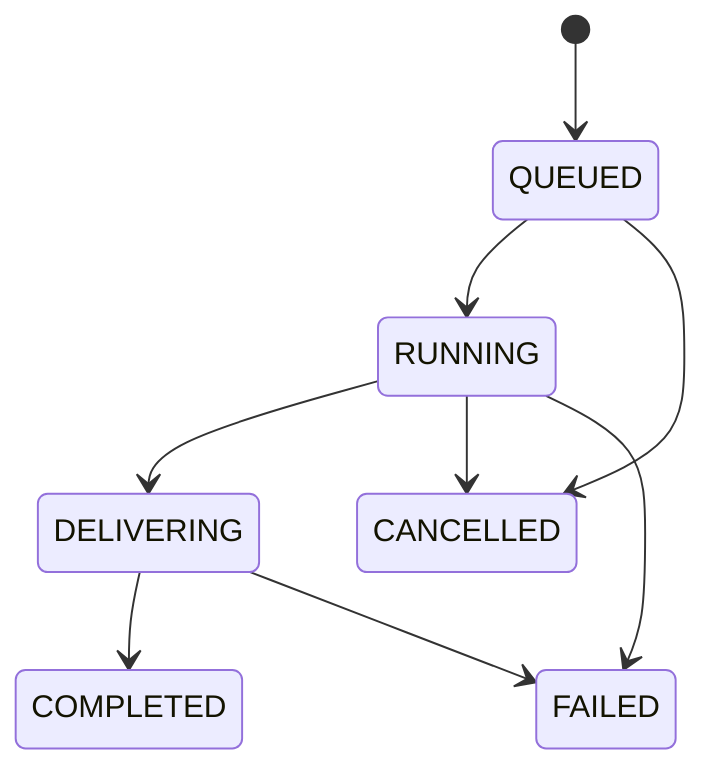

# Architecture

TubeForge is a modular Spring Boot monolith. It is deliberately simpler to run than a microservice deployment while keeping media work isolated from Telegram polling.

## Modules

- `telegram`: Bot API client, polling, update router, inline keyboards and text rendering
- `media`: URL validation, metadata parsing, safe command construction, process lifecycle, storage and FFmpeg utilities
- `service`: users, access rules, sessions, media requests, jobs and delivery
- `domain` and `repository`: persistent state managed through JPA
- `health` and `web`: operational endpoints

## Job lifecycle

The executor has a configurable fixed concurrency and a bounded queue. Each job receives an isolated UUID-named directory. Active processes are tracked by job ID so cancellation terminates the process and its descendants.

## Persistence

Flyway owns the schema. H2 is the zero-setup development database; the Docker deployment uses PostgreSQL. Stored media metadata is reduced to the fields needed by the interface instead of persisting yt-dlp's raw signed URLs.

## Security boundaries

- Only recognized YouTube hosts and HTTP(S) schemes are accepted.
- URI user information is rejected.
- Process commands never pass through a shell.
- Job and request ownership is checked on every callback.
- Callback payloads are capped at Telegram's 64-byte limit.
- The application does not accept cookies, credentials or user-supplied command options.
- Media directories are resolved beneath one configured storage root.
- Tokens and passwords are environment variables excluded by `.gitignore`.

## Delivery

Small results are sent directly. Large video/audio is compressed toward the configured ceiling and, when necessary, segmented into multiple parts. Archives and subtitle documents fail clearly rather than being transformed unsafely.
