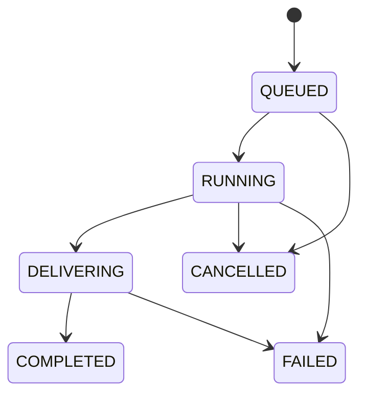

# Architecture

TubeForge is a modular Spring Boot monolith. It is deliberately simpler to run than a microservice deployment while keeping media work isolated from Telegram polling.

## Modules

- `telegram`: Bot API client, polling, update router, inline keyboards and text rendering
- `media`: URL validation, metadata parsing, safe command construction, process lifecycle, storage and FFmpeg utilities
- `service`: users, access rules, sessions, media requests, jobs and delivery
- `ai`: subtitle parsing, deterministic local insights and optional Ollama generation
- `domain` and `repository`: persistent state managed through JPA
- `health` and `web`: operational endpoints

## Job lifecycle

Link acceptance no longer waits for metadata inspection. TubeForge creates a provisional READY request from a canonical YouTube or public Instagram Reel URL and deterministic source ID, displays safe one-tap actions (including `Best Reel`), and hydrates formats/subtitles in a separate bounded executor. The request's metadata state moves through `PENDING`, `READY`, or `DEGRADED`; a degraded inspection never disables quick downloads.

Media work uses its own bounded executor, so a long download cannot freeze new-link previews. Each job receives an isolated UUID-named directory. Active processes are tracked by job ID so cancellation terminates the process and its descendants.

## Cache and request coalescing

TubeForge has three persistent cache levels:

1. Canonical metadata is reused across users by normalized YouTube URL.
2. Uploaded media is stored as a Telegram `file_id` keyed by source, job type, exact format and delivery preferences.
3. AI results are keyed by source, insight type, transcript language, interface language and configured model.

In-memory single-flight maps cover the short interval before a cache entry exists. Identical concurrent metadata requests share one yt-dlp inspection; identical concurrent downloads share one leader job. A cached `file_id` contains no YouTube signed URL and lets Telegram deliver its own server-side copy.

## Persistence

Flyway owns the schema. H2 is the zero-setup development database; the Docker deployment uses PostgreSQL. Stored media metadata is reduced to the fields needed by the interface instead of persisting yt-dlp's raw signed URLs. Cache entries have independent expiration times and scheduled cleanup.

## Security boundaries

- Only recognized YouTube/Instagram hosts and HTTP(S) schemes are accepted.
- URI user information is rejected.
- Process commands never pass through a shell.
- Job and request ownership is checked on every callback.
- Callback payloads are capped at Telegram's 64-byte limit.
- Telegram users cannot supply cookies, credentials, proxies or command options. An operator may configure a private cookies file or proxy through local environment variables.
- Media directories are resolved beneath one configured storage root.
- Tokens and passwords are environment variables excluded by `.gitignore`.

## Delivery

Video delivery probes both streams once. An MP4 that already contains H.264 video and AAC audio bypasses FFmpeg completely; incompatible media is normalized for Telegram playback. Small results are sent directly. Large video/audio is compressed toward the configured ceiling and, when necessary, segmented into multiple parts. Archives and subtitle documents fail clearly rather than being transformed unsafely. Inline media failures fall back to document delivery when Telegram permits it.
